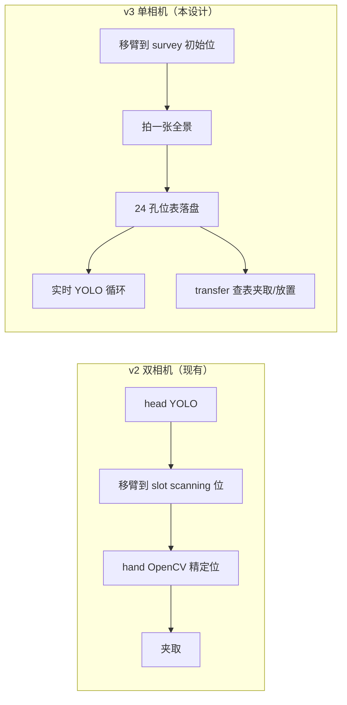
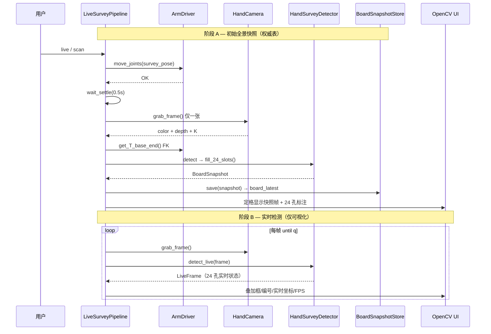
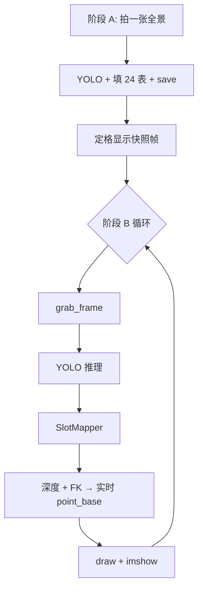
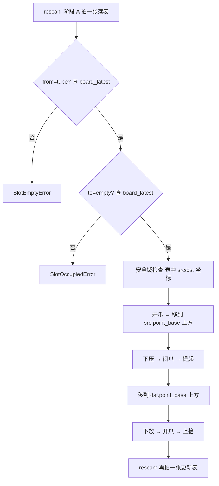

# tubeGrabber v3 架构设计：单 Hand 相机全板扫描

> **文档定位：** 舍弃 head 相机后的终态架构设计书（设计阶段，待实施）。  
> **硬件：** Realman RM-65B + Orbbec Gemini 336L（仅 hand 末端相机）+ RS485 夹爪  
> **相对 v2 的核心变化：** 取消「head 粗检 → 移臂 → hand OpenCV 精定位」双相机链路，改为 **hand 相机在固定俯视位一次拍全板 → YOLO 双类检测 → 24 孔位表 → 按编号直接夹取/放置**。  
> **更新：** 2026-06-29

---

## 目录

1. [设计动机](#1-设计动机)
2. [与 v2 架构对比](#2-与-v2-架构对比)
3. [总体架构](#3-总体架构)
4. [孔位编号体系](#4-孔位编号体系)
5. [YOLO 双类模型](#5-yolo-双类模型)
6. [单次全板扫描流程](#6-单次全板扫描流程)
7. [24 孔位数据表](#7-24-孔位数据表)
8. [三维坐标计算](#8-三维坐标计算)
9. [OpenCV 实时调试界面](#9-opencv-实时调试界面)
10. [夹取与放置控制](#10-夹取与放置控制)
11. [CLI 与 Python 接口](#11-cli-与-python-接口)
12. [配置变更](#12-配置变更)
13. [模块改造清单](#13-模块改造清单)
14. [实施路线与验收](#14-实施路线与验收)
15. [风险与约束](#15-风险与约束)

---

## 1. 设计动机

### 1.1 现有 v2 链路的痛点

| 问题 | 说明 |
|------|------|
| 双相机标定维护成本高 | head Eye-to-Hand + hand Eye-in-Hand 两套标定，任一漂移都会影响精度 |
| 流程长、时延大 | head 检测 → 移臂到 per-slot scanning 位 → hand OpenCV 精定位，至少两次感知 + 一次大行程运动 |
| head 与 hand 坐标系切换 | `P_base_coarse` / `P_base_fine` 两套坐标，协调铁律增加心智负担 |
| OpenCV 精定位脆弱 | HSV 阈值受光照影响大，黑色盖在低光/反光下不稳定 |

### 1.2 新方案目标

```
survey 初始位 → 拍一张全景 → 24 孔位表落盘（权威坐标）
            → 进入实时 YOLO 循环（仅可视化，坐标跟随画面刷新）
            → transfer 查表取坐标 → 夹取/放置
```

| 目标 | 做法 |
|------|------|
| 去掉 head 相机 | 硬件只保留 hand；`dual_camera` 退化为单相机管理器 |
| 全景一次落表 | 在 **survey 初始位**（能拍到左右两架 24 孔）拍 **一张**，YOLO 双类检测后写入 24 行表 |
| 状态可查询 | `BoardSnapshot` 持久化；`transfer` **只读这张表**里的 `status` 与 `point_base` |
| 实时可视化 | 落表完成后进入实时循环，OpenCV 双窗口每帧 YOLO，框/编号/坐标/深度跟随画面 |
| 控制接口简化 | 用户传 `from` / `to` 孔位编号；系统查**已落盘的表**校验后驱动机械臂 |

---

## 2. 与 v2 架构对比



| 维度 | v2 | v3（本设计） |
|------|----|----|
| 相机数量 | head + hand | 仅 hand |
| 感知模式 | 启动时一张落表 + 之后实时预览 | 启动时一张落表 + 之后实时预览 |
| 机械臂用哪份坐标 | — | **仅** `BoardSnapshot`（初始那张），不用实时帧 |
| 检测算法 | head YOLO + hand HSV/椭圆 | hand YOLO（`tube` / `empty`） |
| 坐标变量 | `P_base_coarse` + `P_base_fine` | 统一 `P_base`（表中 `point_base`） |
| 孔位状态 | 仅记录 pick 结果 audit | **全板 24 孔实时快照** |
| 控制入参 | `--slot` 或 `--index` | `--from left.A1 --to right.B2` |
| 空孔处理 | 未实现 | 查表 `status=empty` 直接报错或作为放置目标 |

---

## 3. 总体架构

### 3.1 分层图

```
                    ┌──────────────────────────────────────────┐
                    │  main.py / ui/debug_windows.py            │
                    │  scan · transfer · live                    │
                    └────────────────────┬─────────────────────┘
                                         │
                    ┌────────────────────▼─────────────────────┐
                    │  container.py                             │
                    └────────────────────┬─────────────────────┘
                                         │
        ┌────────────────────────────────┼────────────────────────────────┐
        │                                │                                │
┌───────▼────────┐              ┌────────▼────────┐              ┌─────────▼────────┐
│ pipeline/      │              │ ui/             │              │ state/           │
│ survey         │              │ survey_panel    │              │ board_snapshot   │
│ live           │              │ overlays        │              │ (24-slot table)  │
│ transfer       │              │                 │              │                  │
└───────┬────────┘              └─────────────────┘              └──────────────────┘
        │
┌───────▼──────────────────────────────────────────────────────────────────────────┐
│ vision/                                                                          │
│ hand_survey.py (YOLO 双类全板) · slot_mapper.py · geometry.py                   │
└───────┬──────────────────────────────────────────────────────────────────────────┘
        │
┌───────▼────────┐              ┌──────────────────────────────────────────────────┐
│ motion/        │              │ drivers/                                         │
│ survey_motion  │              │ arm.py · camera.py · hand_camera.py（单相机）    │
│ grasp_*        │              │                                                  │
│ place_*（新）  │              │                                                  │
└────────────────┘              └──────────────────────────────────────────────────┘
```

### 3.2 协调铁律（简化版）

| 变量 | 含义 | 用途 |
|------|------|------|
| `BoardSnapshot` | survey 初始位**拍一张**产出的 24 孔位表 | **唯一权威**：`transfer` 查 `status`、取 `point_base`、驱动机械臂 |
| `LiveFrame` | 实时循环每帧 YOLO 结果（内存，不落盘） | **仅 UI 显示**：框/编号/坐标跟随画面刷新 |
| `P_base`（表中） | 初始快照时刻的深度 + FK 反投影 | 夹取、放置、安全检查 |
| `P_base`（实时） | 每帧重算的基座坐标 | 调试叠加文字，**禁止**直接用于 `transfer` |
| survey 初始位 | 能拍到 24 孔全景的示教关节角 | 初始快照与实时循环均在此位执行；臂静止 |

**两阶段铁律：**

1. **必须先有一张全景快照落表**，才能 `transfer` 或认为系统「就绪」。
2. **实时检测不改变权威表**（除非用户主动 `s` 重拍落表）。

> v2 的 `P_base_coarse` / `P_base_fine` 区分在本设计中取消。

---

## 4. 孔位编号体系

与 `config/rack.yaml` 保持一致，共 **24 个物理孔位** = 2 架 × 4 行 × 3 列。

### 4.1 命名规则

格式：`{board}.{row}{col}`，例如 `left.B2`、`right.A3`。

### 4.2 图像视角（hand 俯视）

hand 相机在 survey 位正上方俯视两架试管架：

```
图像左侧                          图像右侧
┌─────────────────┐              ┌─────────────────┐
│  left 架        │              │  right 架       │
│  列: 3  2  1    │   ←对称→    │  列: 1  2  3    │
│  行: D         │              │  行: D          │
│      C         │              │      C          │
│      B         │              │      B          │
│      A (下)    │              │      A (下)     │
└─────────────────┘              └─────────────────┘
```

记忆口诀：**左 123 abcd，右 123 abcd**（列号方向镜像，行号 A 在图像下方）。

### 4.3 槽位映射算法

沿用 `vision/slot_mapper.py` 思路，改为 `perspective="hand_survey"`：

1. 按图像 `split_x`（默认 `width/2`）分左右架；
2. 每个 YOLO 框中心 `(u, v)` 归入对应架；
3. 按 `v` 坐标聚类 4 行（A–D），按 `u` 排序分配 3 列（左架降序、右架升序）；
4. 输出 `SlotId(board, row, col)`。

**冲突处理：** 同一 `SlotId` 出现多个检测 → 取置信度最高者，其余记入 `meta.warnings`。

---

## 5. YOLO 双类模型

### 5.1 类别定义

| class_id | 名称 | 含义 | 训练标注对象 |
|----------|------|------|-------------|
| 0 | `tube` | 有试管 | 试管盖（或盖+管顶）可见 |
| 1 | `empty` | 无试管（空孔） | 空孔开口、孔位圆环、或架上的空位标记 |

> 两类都需要在 survey 俯视位下采集，保证与运行时视角一致。

### 5.2 训练数据要求

| 项 | 建议 |
|----|------|
| 采集姿态 | 与运行时 **完全相同** 的 survey 关节角 |
| 每类样本量 | 每类 ≥ 200 张裁剪/框，覆盖 24 孔位各种组合 |
| 增强 | 亮度 ±20%、轻微模糊；**不做** 大角度旋转（俯视固定） |
| 标注 | 每孔一个框；有盖标 `tube`，空孔标 `empty` |
| 输出 | `assets/model/survey_best.pt` |

### 5.3 推理参数（`config/perception.yaml`）

```yaml
yolo:
  model: "assets/model/survey_best.pt"
  conf: 0.45          # 可适当低于 v2 head，因近距离目标更大
  iou: 0.50           # NMS，避免同一孔多框
  imgsz: 640
  device: "cuda:0"
  classes: ["tube", "empty"]
```

### 5.4 从检测到 24 行表

YOLO 只输出「有框的孔位」。要凑齐 24 行，采用 **显式检测 + 网格补全** 策略：

```
1. YOLO 推理 → 带 class 的检测列表
2. SlotMapper → 为每个检测分配 SlotId
3. 初始化 24 行模板（全部 status=unknown）
4. 用检测覆盖对应行：
     class=tube  → status=tube
     class=empty → status=empty
5. 未覆盖的孔位：
     - 若配置了固定网格先验（可选）→ status=empty, confidence=0
     - 否则保持 status=unknown，UI 标红，transfer 时拒绝
```

推荐：**以 YOLO 双类为主**，训练时确保空孔也有稳定框，尽量减少 `unknown`。

---

## 6. 两阶段感知流程

系统感知分为 **阶段 A（初始全景快照）** 与 **阶段 B（实时检测）**，顺序固定，不可跳过 A。



### 6.1 Survey 初始位示教

新增 `config/survey.yaml`（**一个**关节角，能拍到左右两架 24 孔全景）：

```yaml
survey:
  joints_deg: [j1, j2, j3, j4, j5, j6]   # record-survey 命令示教
  settle_s: 0.5
  speed: 25
  snapshot_median_frames: 3   # 初始快照可融合 3 帧深度中位数，提高落表精度
```

示教命令：

```bash
python main.py record-survey    # 当前关节角写入 survey.yaml
```

**验收：** survey 初始位下 color 图能同时看清左右两架全部 24 孔，且深度有效像素覆盖率 > 90%。

### 6.2 阶段 A：初始全景快照（拍一张 → 落表）

| 步骤 | 说明 |
|------|------|
| 1. 移臂 | `move_joints(survey.joints_deg)` |
| 2. 稳定 | `wait_settle(survey.settle_s)`，臂静止 |
| 3. 拍一张 | 取 1 帧（或 `snapshot_median_frames` 帧融合为一帧深度） |
| 4. YOLO | 双类推理 + SlotMapper + 几何解算 |
| 5. 填表 | `fill_24_slots()` → 固定 24 行 |
| 6. 落盘 | `BoardSnapshotStore.save()` → `data/board_latest.json` |
| 7. 定格 | UI 显示这张快照的标注（可选停留 1s 再进实时） |

**表中记录字段（每孔）：** `slot_id`、`status`、`confidence`、`pixel`、`bbox`、`depth_m`、`point_base`、`class_name`，以及快照级 `timestamp`、`T_base_end`、`image_path`。

### 6.3 阶段 B：实时检测（落表之后）

| 步骤 | 说明 |
|------|------|
| 前提 | 阶段 A 已完成，`board_latest` 存在 |
| 臂姿态 | **保持 survey 初始位不动** |
| 每帧 | 采图 → YOLO → 坐标重算 → OpenCV 刷新 |
| 数据去向 | 结果仅在内存 `LiveFrame`，**不写** `board_latest` |
| 用途 | 观察试管是否被取走、空孔是否放上试管等变化 |

实时画面上的 `base(x,y,z)` 每帧跟随检测框更新；**机械臂执行 `transfer` 时仍读阶段 A 的快照表**。

### 6.4 何时重新落表（刷新权威表）

| 场景 | 行为 |
|------|------|
| `live` / `scan` 启动 | **自动**执行阶段 A |
| `live` 中按 `s` | 暂停实时 → 再拍一张 → 覆盖 `board_latest` → 继续实时 |
| `transfer` 前 | 默认 `rescan=true`：先执行阶段 A 再动作 |
| `transfer --no-rescan` | 直接用已有 `board_latest`（调试慎用） |

---

## 7. 24 孔位数据表

### 7.1 行记录 `SlotRecord`

```python
@dataclass
class SlotRecord:
    slot_id:       SlotId           # left.B2
    status:        str              # "tube" | "empty" | "unknown"
    confidence:    float            # YOLO conf
    pixel:         tuple[float,float] | None   # 框中心 (u,v)
    bbox:          list[float] | None           # [x1,y1,x2,y2]
    depth_m:       float | None                 # 深度图中位数（米）
    point_base:    Point3D | None               # 基座系 XYZ（米）
    class_name:    str              # "tube" | "empty"
```

### 7.2 快照 `BoardSnapshot`

```python
@dataclass
class BoardSnapshot:
    snapshot_id:   str              # uuid 短码
    timestamp:     float
    survey_joints: list[float]      # 扫描时关节角（审计）
    T_base_end:    list[list[float]] # 4×4 FK（审计）
    image_path:    str | None        # 可选：存档 color 图
    slots:         list[SlotRecord]  # 固定 24 行，按 slot 排序
```

### 7.2.1 实时帧 `LiveFrame`（阶段 B，仅内存）

```python
@dataclass
class LiveFrame:
    """实时循环单帧结果，不落盘。"""
    timestamp:     float
    fps:           float
    slots:         list[SlotRecord]  # 当前帧 YOLO + 实时 point_base
    snapshot_id:   str              # 关联的权威表 id（UI 角标用）
```

`LiveFrame.slots` 与 `BoardSnapshot.slots` 结构相同，但坐标每帧重算，**不写入** `BoardSnapshotStore`。

### 7.3 存储方案

**推荐：JSON 文件 + 内存缓存**（与现有 `JsonFileStore` 风格一致，零依赖）。

路径：`data/board_snapshots/{snapshot_id}.json`  
索引：`data/board_latest.json` → 指向最近一次快照 id。

```
data/
  board_latest.json
  board_snapshots/
    a3f8c2b1.json    # 含 24 行 slots[]
    ...
```

**可选升级：** SQLite 单表 `slot_snapshots`，便于按时间查询历史；首版可不做。

#### 表结构（逻辑视图）

| slot | status | conf | u | v | depth_m | x | y | z | class |
|------|--------|------|---|---|---------|---|---|---|-------|
| left.A1 | tube | 0.91 | 120 | 380 | 0.412 | 0.152 | -0.231 | 0.089 | tube |
| left.A2 | empty | 0.87 | 200 | 378 | 0.415 | 0.148 | -0.198 | 0.088 | empty |
| ... | ... | ... | ... | ... | ... | ... | ... | ... | ... |
| right.D3 | tube | 0.93 | 580 | 95 | 0.408 | -0.142 | 0.221 | 0.091 | tube |

共 **24 行**，`slot` 为主键。

### 7.4 查询接口

```python
class BoardSnapshotStore:
    def save(self, snap: BoardSnapshot) -> None: ...       # 阶段 A 落盘
    def latest(self) -> BoardSnapshot | None: ...          # transfer 读此
    def get_slot(self, slot: SlotId) -> SlotRecord | None: ...
    def require_tube(self, slot: SlotId) -> SlotRecord: ...
    def require_empty(self, slot: SlotId) -> SlotRecord: ...
```

**注意：** 实时循环中的 `LiveFrame` 不经过此 Store；只有阶段 A（或按 `s` 重拍）才调用 `save()`。

---

## 8. 三维坐标计算

### 8.1 公式（与 v2 hand 精定位相同）

```
像素 (u, v) + 深度 d
  → P_cam = K⁻¹ · [u·d, v·d, d]ᵀ
  → P_base = T_base_end @ T_cam_end @ P_cam
```

- `T_cam_end`：手眼标定（`assets/calib/T_cam_end.json`）
- `T_base_end`：扫描瞬间 FK（`arm.get_T_base_end()`）；**`live` 模式下每帧重新读取 FK**

### 8.2 深度采样

| 检测类型 | 采样区域 |
|----------|----------|
| `tube` | bbox 内缩 10% 后深度中位数 |
| `empty` | 框中心半径 12px 圆内深度中位数 |

有效范围：`0.10 m ~ 2.00 m`（沿用 `vision/geometry.py`）。

### 8.3 坐标用途

| 数据来源 | 孔位状态 | 坐标用于 |
|----------|----------|----------|
| **BoardSnapshot**（阶段 A） | `tube` | 夹取规划 `GraspPlanner.plan(point_base)` |
| **BoardSnapshot**（阶段 A） | `empty` | 放置规划 `PlacePlanner.plan(point_base)` |
| **BoardSnapshot**（阶段 A） | `unknown` | `transfer` 报错 |
| **LiveFrame**（阶段 B） | 任意 | **仅 UI 叠加**，不驱动机械臂 |

---

## 9. OpenCV 调试界面

### 9.1 模式划分

| 模式 | 命令 | 行为 |
|------|------|------|
| **推荐入口** | `live` | 阶段 A：移臂 → **拍一张** → 24 孔落表 → 阶段 B：实时 YOLO 循环 |
| **仅落表** | `scan` | 只执行阶段 A（移臂 → 拍一张 → 落表 → 定格显示），不进入实时 |
| **继续实时** | `live --no-rescan` | 臂已在 survey 位且已有 `board_latest` 时，跳过阶段 A，直接进入阶段 B |

**标准上机流程：**

```bash
python main.py live
# → 自动：survey 位拍一张 → 表写入 data/board_latest.json
# → 自动：进入实时双窗口，坐标跟随每帧刷新
# → 按 t 或另开终端 transfer（读的是刚才那张快照的坐标）
```

### 9.2 实时循环架构（`pipeline/live_survey.py`）



**阶段 B 每帧流水线（目标 ≥ 15 FPS）：**

```
1. hand 相机取最新 FramePacket（臂保持 survey 初始位静止）
2. YOLO 双类推理 → 检测列表
3. SlotMapper → SlotId
4. 读当前 FK → 逐孔计算 depth_m + point_base（实时显示用）
5. 组装 LiveFrame（内存，不写 board_latest）
6. overlays 绘制：实时框 + 实时坐标 + 角标显示快照 id
7. cv2.imshow 刷新双窗口
```

**坐标跟随原则：** 实时画面上 `base(x,y,z)` 绑在检测框旁，每帧重算；角标同时显示 `snapshot=a3f8c2` 提醒机械臂用的是哪张快照表。

### 9.3 窗口布局

| 窗口名 | 内容 |
|--------|------|
| `Survey Color` | 彩色图 + 全部检测实时叠加 |
| `Survey Depth` | 深度伪彩 + 中心点与 Z 值实时标注 |

窗口名配置见 `config/display.yaml`：

```yaml
display:
  survey_window: "tubeGrabber — Survey"
  depth_window: "tubeGrabber — Depth"
  show_depth_panel: true
  refresh_hz: 30          # 实时循环目标帧率上限
  show_base_coords: true
  show_slot_id: true
```

### 9.4 彩色图叠加内容（每个孔位）

沿用 `ui/overlays.py` 风格，扩展 `draw_slot_record()`：

```
┌─────────────────────────────┐
│  ┌───┐  left.A1             │
│  │   │  tube conf=0.91       │
│  └───┘  base(0.152,-0.231,0.089) │
│      + 中心十字              │
└─────────────────────────────┘
```

| 元素 | 说明 |
|------|------|
| 矩形框 | `tube` 绿色，`empty` 蓝色，`unknown` 红色虚线 |
| 中心十字 | 当前帧 bbox 中心 `(u,v)`，随检测框移动 |
| 文本行 1 | 孔位编号 `left.A1` / `right.C3` |
| 文本行 2 | `tube conf=0.91` 或 `empty conf=0.87` |
| 文本行 3 | `base(x,y,z)` 三位小数，单位米，**每帧重算** |
| 全板角标 | 左上角 `snapshot=a3f8c2 | FPS=28 | live: tubes=12 empty=11` |

角标中 `snapshot=...` 为阶段 A 权威表 id；`live: tubes=...` 为当前帧实时统计（两者可能不一致，以表为准执行动作）。

> **不做序号高亮：** 不提供 `1`–`9` 按序号选中孔位功能。

### 9.5 深度图叠加

- JET 伪彩（沿用 `depth_to_colormap`）
- 每个孔位中心画圆点 + 旁注 `Z=0.412m`（与彩色图同源、同帧深度）
- 坐标文字紧贴圆点右侧，随中心点实时移动

### 9.6 交互快捷键（`live` 阶段 B）

| 键 | 功能 |
|----|------|
| `s` | **重新落表**：暂停实时 → 再拍一张全景 → 覆盖 `board_latest` → 继续实时 |
| `t` | 对当前 `board_latest` 执行 `transfer`（需启动参数指定 `--from` / `--to`） |
| `q` | 退出 |

**已删除：** `1`–`9` 序号高亮（v2 `live` 遗留交互，v3 不需要）。

---

## 10. 夹取与放置控制

### 10.1 用户接口语义

```bash
# 从 left.A1 夹取试管，放到 right.B2 空孔
python main.py transfer --from left.A1 --to right.B2
```

| 参数 | 必填 | 说明 |
|------|------|------|
| `--from` | 是 | 源孔位，表中必须为 `tube` |
| `--to` | 是 | 目标孔位，表中必须为 `empty` |
| `--no-rescan` | 否 | 跳过扫描，使用 `board_latest`（调试慎用） |
| `--init-gripper` | 否 | 执行前张开夹爪 |

### 10.2 状态校验（查表）

```python
def validate_transfer(from_slot, to_slot, snap: BoardSnapshot):
    src = snap.get_slot(from_slot)
    dst = snap.get_slot(to_slot)

    if src.status != "tube":
        raise SlotEmptyError(f"{from_slot} 状态为 {src.status}，无法夹取")
    if dst.status != "empty":
        raise SlotOccupiedError(f"{to_slot} 状态为 {dst.status}，无法放置")
    if src.point_base is None or dst.point_base is None:
        raise CoordMissingError("坐标缺失")
```

### 10.3 运动序列



> `transfer` 全程使用 **BoardSnapshot 中的 `point_base`**，不使用实时帧坐标。

**复用模块：**

- 夹取：`motion/grasp_planner.py` + `grasp_executor.py`（与 v2 相同，输入改为 `src.point_base`）
- 放置：新增 `motion/place_planner.py` + `place_executor.py`（镜像 grasp 逻辑，Z 偏移符号相反）

### 10.4 放置规划示意

```yaml
# config/place.yaml（新增）
place:
  pre_offset_z: 0.080      # 目标孔上方 80mm
  touch_offset_z: 0.005    # 下放到孔口上方 5mm
  retract_offset_z: 0.100  # 放置后抬起
  gripper_open: 0.85
  speed_approach: 20
  speed_place: 10
  speed_retract: 25
```

### 10.5 错误码

| 错误 | HTTP 类比 | 场景 |
|------|-----------|------|
| `SlotEmptyError` | 409 | `--from` 孔位无试管 |
| `SlotOccupiedError` | 409 | `--to` 孔位非空 |
| `SlotUnknownError` | 422 | 孔位 YOLO 未覆盖 |
| `SnapshotStaleError` | 412 | `--no-rescan` 但快照超过 N 秒 |
| `SafetyViolation` | 400 | 坐标超出工作空间 |

---

## 11. CLI 与 Python 接口

### 11.1 CLI 命令（v3）

| 命令 | 说明 |
|------|------|
| `live` | **主入口**：survey 初始位 → 拍一张落表 → 进入实时 YOLO（`s` 可重拍落表） |
| `live --no-rescan` | 跳过阶段 A，直接实时（要求已有 `board_latest` 且臂在 survey 位） |
| `scan` | 仅阶段 A：拍一张 → 落表 → 定格显示，不进实时 |
| `transfer --from S --to D` | 默认先阶段 A 落表 → 查表 → 夹取 → 放置 → 再落表 |
| `record-survey` | 示教 survey 关节角 → `survey.yaml` |
| `show-board` | 打印 `board_latest` 24 行表（终端表格） |
| `check` | 自检：臂、hand 相机、标定、YOLO 模型 |
| `calib` | 手眼标定（仅 `T_cam_end`，不再需要 head 标定） |

**移除：** v2 `live`（head 实时）、`debug-head`、`pick`（单槽粗精流程）、per-slot `record-scan`（可选保留作迁移期备用）。  
**新增：** v3 `live`（hand survey 实时 YOLO，取代原 `debug-survey` 命名）。

### 11.2 Python 库

```python
from container import Container
from pipeline.context import SlotId

c = Container()
c.build()

# 推荐：先拍一张落表，再实时（一条命令完成两阶段）
c.live_survey.run()   # 阶段 A + 阶段 B

# 或拆分调用
snap = c.survey.run()          # 仅阶段 A
c.live_survey.run(no_rescan=True)  # 仅阶段 B

# transfer 读 board_latest（阶段 A 的坐标），不是实时帧
ok = c.transfer.run(
    from_slot=SlotId.parse("left.A1"),
    to_slot=SlotId.parse("right.B2"),
    rescan=True,   # 动作前再拍一张刷新表
)
c.shutdown()
```

---

## 12. 配置变更

### 12.1 新增

| 文件 | 内容 |
|------|------|
| `config/survey.yaml` | survey 关节角、稳定等待时间 |
| `config/place.yaml` | 放置 Z 偏移与速度 |
| `assets/model/survey_best.pt` | 双类 YOLO 权重 |

### 12.2 修改

| 文件 | 变更 |
|------|------|
| `config/hardware.yaml` | 删除 `head_serial`；仅保留 `hand_serial` |
| `config/perception.yaml` | 删除 `head.*`、`hand.hsv_*`；新增 `survey.median_frames` |
| `config/rack.yaml` | `head_split_x` 改名为 `board_split_x`；`perspective: hand_survey` |
| `config/calib.yaml` | 删除 `T_camera_to_base` 路径 |

### 12.3 可删除（迁移完成后）

- `vision/head_coarse.py`
- `vision/hand_fine.py`（OpenCV 精定位）
- `pipeline/live.py`（v2 head 版，由 `live_survey.py` 替代）
- `pipeline/pick.py`（由 `transfer` 替代）
- `assets/calib/T_camera_to_base.json`
- head 相机标定脚本相关逻辑

---

## 13. 模块改造清单

| 优先级 | 模块 | 动作 |
|--------|------|------|
| P0 | `vision/hand_survey.py` | **新建** — hand YOLO 双类 + 坐标 + 填 24 表 |
| P0 | `pipeline/survey.py` | **新建** — 阶段 A：拍一张全景 → 填 24 表 → 落盘 |
| P0 | `pipeline/transfer.py` | **新建** — 查表校验 + 夹取放置 |
| P0 | `state/board_snapshot_store.py` | **新建** — 24 孔位快照持久化 |
| P0 | `motion/place_planner.py` | **新建** — 放置位姿规划 |
| P0 | `motion/place_executor.py` | **新建** — 放置动作执行 |
| P1 | `drivers/hand_camera.py` | **新建** — 单相机封装（从 `dual_camera` 拆分） |
| P0 | `pipeline/live_survey.py` | **新建** — 阶段 A + 阶段 B（`live` 主入口） |
| P1 | `ui/overlays.py` | **扩展** — `draw_slot_record`、24 孔位角标（无选中高亮） |
| P1 | `vision/slot_mapper.py` | **修改** — `perspective="hand_survey"` |
| P1 | `container.py` / `main.py` | **修改** — 新命令注册，移除 head 依赖 |
| P2 | `motion/scanning.py` | **简化** — 仅保留 `goto_survey()` |
| P2 | `pipeline/context.py` | **扩展** — `SlotRecord`、`BoardSnapshot`、`LiveFrame` |
| P3 | 删除 head 相关 | 清理标定、配置、文档 |

---

## 14. 实施路线与验收

### 14.1 阶段划分

| 阶段 | 内容 | 验收标准 |
|------|------|----------|
| **S1 硬件位** | 示教 survey 位；确认 24 孔全在 FOV 内 | 静态图肉眼可辨 24 孔 |
| **S2 数据集** | 采集并标注 `tube`/`empty`；训练 YOLO | val mAP50 ≥ 0.85，每孔召回 > 95% |
| **S3 感知链** | 阶段 A `survey` | `scan` 输出 24 行 JSON，坐标重复精度 σ < 2mm |
| **S4 可视化** | 阶段 B `live` | 落表后实时双窗口，框/坐标跟随，FPS ≥ 15 |
| **S5 夹取** | `transfer` 仅夹取（to=同一架空孔） | 连续 10 次成功率 ≥ 9 |
| **S6 放置** | 完整 `transfer --from --to` | 跨架转移 10 次成功率 ≥ 8 |
| **S7 清理** | 移除 head 代码与配置 | `check` 无 head 依赖 |

### 14.2 核心验收用例

```bash
# 1. 标准流程：先落表再实时
python main.py live
# 启动后应先看到「快照定格」再进入实时刷新

# 2. 仅拍一张落表
python main.py scan
python main.py show-board   # 24 行

# 3. 空孔夹取应失败（读 board_latest）
python main.py transfer --from right.A3 --to left.B1

# 4. 正常转移（动作前后各落表一次）
python main.py transfer --from left.A1 --to right.C2
```

---

## 15. 风险与约束

| 风险 | 影响 | 缓解 |
|------|------|------|
| survey 位 FOV 盖不住 24 孔 | 无法一次拍全板 | 提高相机高度 / 换广角 / 退化为两帧（左架+右架）— **违背单张原则，需硬件调整** |
| 空孔特征不明显，YOLO 漏检 | 表中出现 `unknown` | 增加空孔标注多样性；或引入固定 24 网格几何先验补全 |
| 臂振动导致 FK 误差 | 基座坐标漂移 | `settle_s` ≥ 0.5s；扫描时禁止运动 |
| 仅一张图，无精定位冗余 | 深度噪声直接进夹取 | bbox 深度中位数 + 多帧 median（`survey.median_frames: 3`） |
| 放置未实现碰撞检测 | 试管碰架 | 放置 touch 留 `touch_offset_z`；速度放低 |
| 表与物理不同步 | 实时看到试管没了但表里仍是 tube | `transfer` 默认动作前 `rescan`；`live` 中按 `s` 重拍落表 |
| 实时坐标与表坐标不一致 | 用户误用实时坐标调臂 | UI 角标区分 `snapshot=` vs `live:`；`transfer` 硬编码只读 Store |

### 15.1 关键前提（上机前必须满足）

1. **hand 在 survey 位能一次看到 24 孔** — 这是本方案的地基；若不满足，请先调机械臂/相机支架，而不是改算法。
2. **手眼标定 `T_cam_end` 准确** — 单相机后这是唯一视觉标定，建议重标定后验精度 < 3mm。
3. **YOLO 空孔类必须训好** — 否则无法自动判断放置目标是否为空。

---

## 附录 A：与 v2 文件映射

| v2 | v3 |
|----|-----|
| `HeadCoarseDetector` | `HandSurveyDetector` |
| `HandFineDetector` (OpenCV) | 删除 |
| `PickPipeline` | `TransferPipeline` |
| `ScanPipeline` (head) | `SurveyPipeline` (hand) |
| `LivePerceptionLoop` (head) | `LiveSurveyLoop` (hand 实时 YOLO) |
| `JsonFileStore` (pick audit) | `BoardSnapshotStore` (24 孔快照) |
| `P_base_coarse` / `P_base_fine` | `SlotRecord.point_base` |
| `slots.yaml` (per-slot 关节) | `survey.yaml` (单一位) |

## 附录 B：`SlotRecord` JSON 示例

```json
{
  "snapshot_id": "a3f8c2b1",
  "timestamp": 1719667200.12,
  "slots": [
    {
      "slot": "left.A1",
      "status": "tube",
      "class_name": "tube",
      "confidence": 0.91,
      "pixel": [118.5, 382.0],
      "bbox": [100, 365, 137, 399],
      "depth_m": 0.412,
      "point_base": { "x": 0.152, "y": -0.231, "z": 0.089, "frame": "base" }
    },
    {
      "slot": "left.A2",
      "status": "empty",
      "class_name": "empty",
      "confidence": 0.87,
      "pixel": [198.2, 380.5],
      "bbox": [180, 363, 216, 398],
      "depth_m": 0.415,
      "point_base": { "x": 0.148, "y": -0.198, "z": 0.088, "frame": "base" }
    }
  ]
}
```

---

**下一步建议：** 先完成 **S1 survey 位示教 + S2 双类数据集采集**，确认 24 孔单张可行性后，再按 [§13 模块改造清单](#13-模块改造清单) 从 `hand_survey.py` 和 `BoardSnapshotStore` 开始编码。
